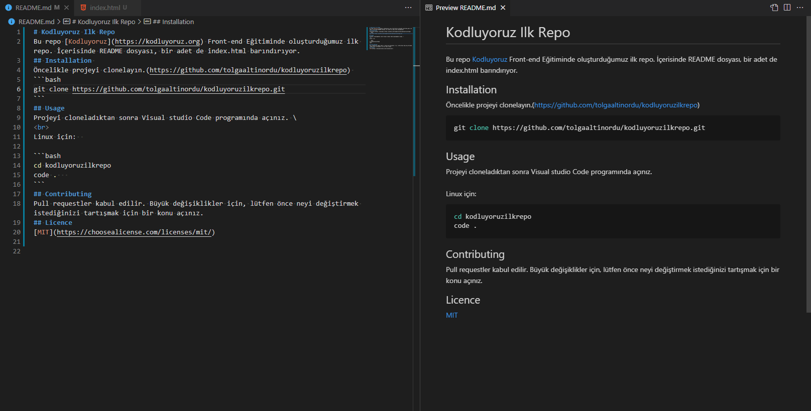

# Kodluyoruz Ilk Repo
Bu repo [Kodluyoruz](https://kodluyoruz.org) Front-end Eğitiminde oluşturduğumuz ilk repo. İçerisinde README dosyası, bir adet de index.html barındırıyor.

## Installation 
Öncelikle projeyi clonelayın.(https://github.com/tolgaaltinordu/kodluyoruzilkrepo) 
```bash
git clone https://github.com/tolgaaltinordu/kodluyoruzilkrepo.git
```
## Usage
Projeyi cloneladıktan sonra Visual studio Code programında açınız. \
<br>
Linux için:  

```bash
cd kodluyoruzilkrepo
code .   
```
## Contributing
Pull requestler kabul edilir. Büyük değişiklikler için, lütfen önce neyi değiştirmek istediğinizi tartışmak için bir konu açınız.
## Licence
[MIT](https://choosealicense.com/licenses/mit/)

